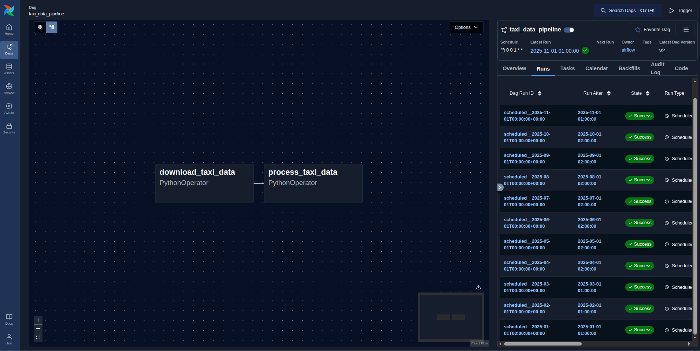
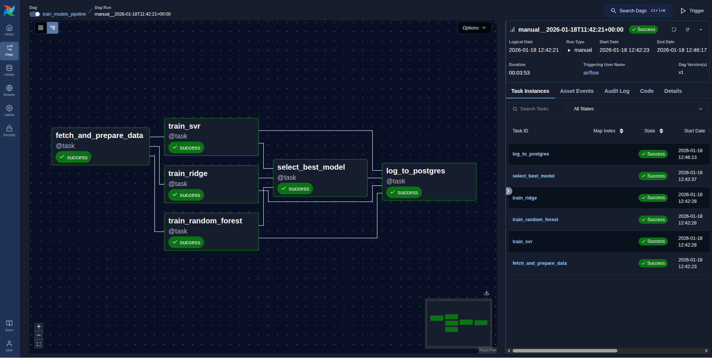
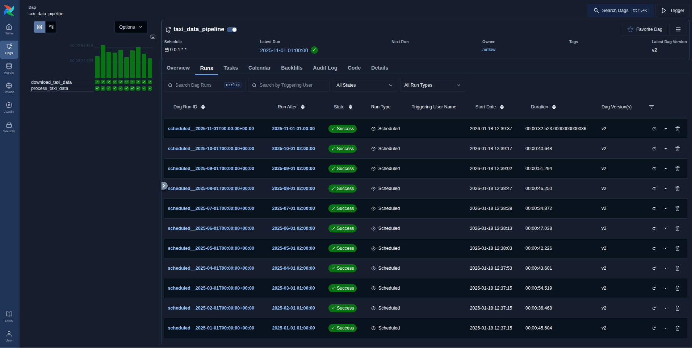
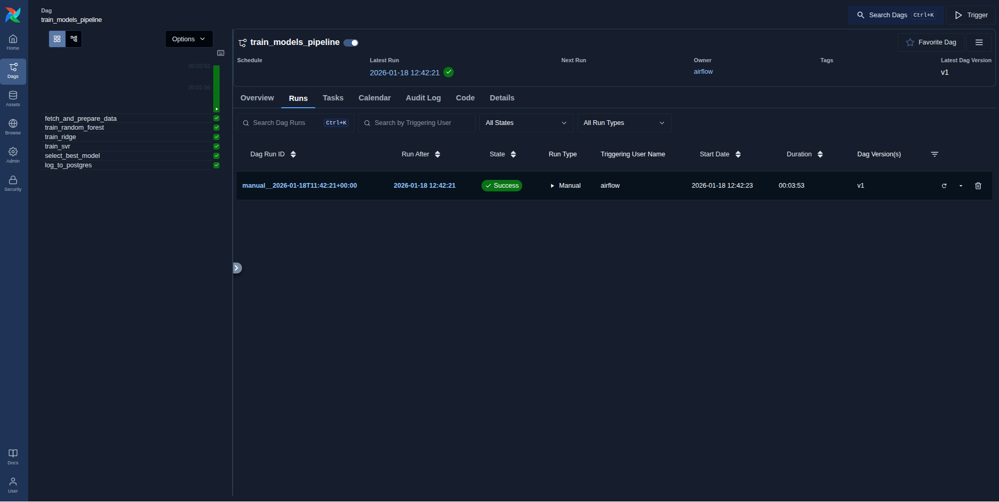
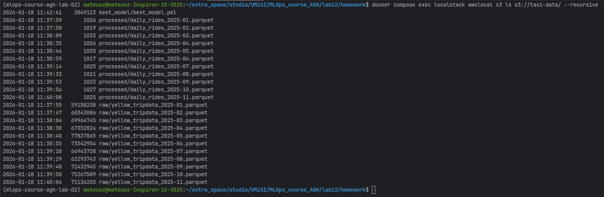
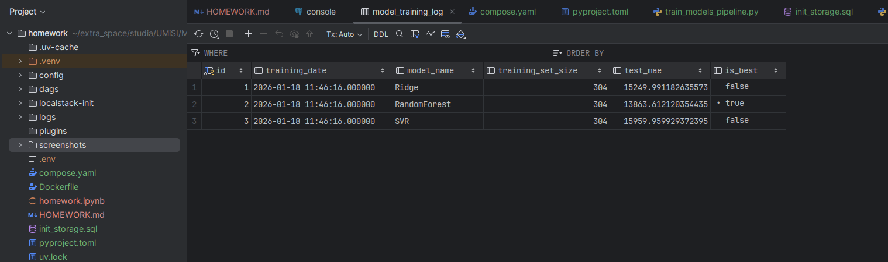

# MLOps Homework - Screenshots

## 1. DAG Graphs

### 1.1 taxi_data_pipeline DAG Graph

---

### 1.2 train_models_pipeline DAG Graph

---

## 2. DAG Executions

### 2.1 taxi_data_pipeline Executions

---

### 2.2 train_models_pipeline Executions

---

## 3. S3 Bucket File Lists

---

## 4. Postgres Table with ML Models Results

---
